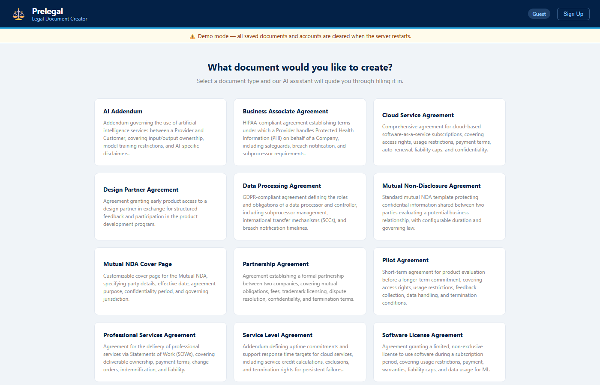
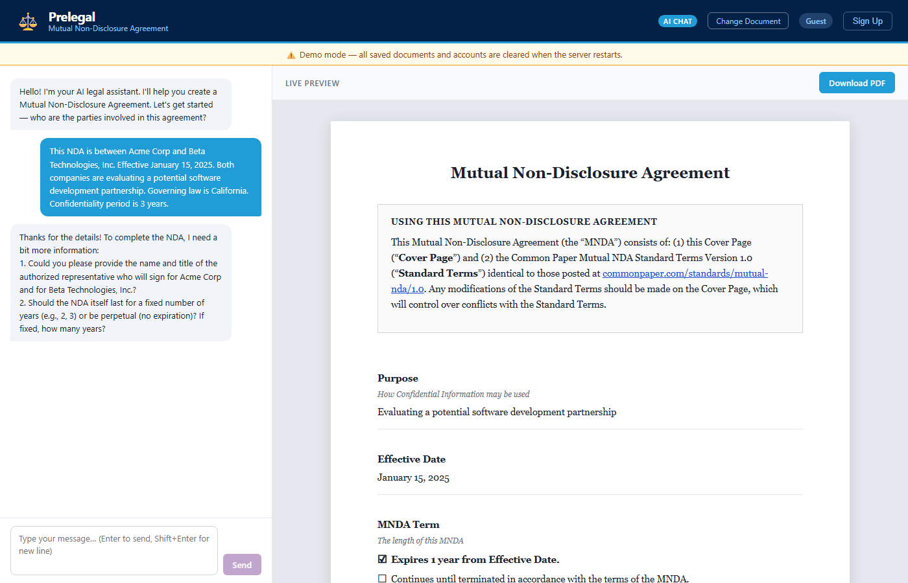

# Prelegal

AI-powered legal document generator. Chat with an AI assistant to fill in 12 types of legal document templates, then download as PDF.


> **Demo mode** — accounts and saved documents are cleared each time the server restarts. This is by design for the demo deployment.

---

## Screenshots

<p align="center">
  
  
</p>

---

## Features

- **12 legal document types** — NDAs, SLAs, DPAs, partnership agreements, software licenses, and more
- **AI chat interface** — describe your situation in plain English; the AI fills in the document fields
- **Live preview** — see the formatted document update in real time as fields are populated
- **PDF download** — one-click export of any completed document
- **Guest mode** — try the tool without creating an account; form state persists in localStorage
- **Account system** — register/login to save documents and resume them later
- **Document history** — browse and re-open any previously saved document

## Supported Document Types

| Document | Description |
|----------|-------------|
| Mutual Non-Disclosure Agreement | Standard mutual NDA for two parties evaluating a business relationship |
| Mutual NDA Cover Page | Customizable cover page specifying party details and jurisdiction |
| AI Addendum | Governs use of AI services — input/output ownership, model training restrictions |
| Business Associate Agreement | HIPAA-compliant BAA for handling Protected Health Information |
| Cloud Service Agreement | SaaS subscription terms — access, payment, liability caps, auto-renewal |
| Data Processing Agreement | GDPR-compliant DPA with subprocessor management and breach notification |
| Design Partner Agreement | Early product access in exchange for structured feedback |
| Partnership Agreement | Formal partnership covering obligations, fees, trademarks, termination |
| Pilot Agreement | Short-term product evaluation before longer-term commitment |
| Professional Services Agreement | Services via SOWs — deliverables, payment, change orders, indemnification |
| Service Level Agreement | Uptime commitments, support SLAs, service credits |
| Software License Agreement | Limited non-exclusive license — usage restrictions, payment, data/ML terms |

## Tech Stack

| Layer | Technology |
|-------|------------|
| Frontend | SolidJS + TypeScript, `@solidjs/router` |
| Backend | FastAPI (Python 3.13), SQLModel, `python-jose`, bcrypt |
| AI | LiteLLM → OpenRouter (`openai/gpt-oss-120b:free` with free-model fallback) |
| Database | SQLite (ephemeral — resets on container restart) |
| Serving | Static frontend built into Docker image, served by FastAPI |

---

## Quick Start

### Prerequisites

- Docker and Docker Compose
- An [OpenRouter](https://openrouter.ai) API key (free tier works)

### Setup

1. Copy the environment template:
   ```bash
   cp .env.example .env
   ```

2. Fill in `.env`:
   ```env
   OPENROUTER_API_KEY=your_openrouter_api_key_here
   SECRET_KEY=any_random_string_for_jwt_signing
   ```

3. Start with the platform script:

   **Mac:**
   ```bash
   bash scripts/start-mac.sh
   ```

   **Linux:**
   ```bash
   bash scripts/start-linux.sh
   ```

   **Windows (PowerShell):**
   ```powershell
   .\scripts\start-windows.ps1
   ```

   Or directly with Docker Compose:
   ```bash
   docker compose up --build
   ```

4. Open [http://localhost:8000](http://localhost:8000)

### Stop

```bash
bash scripts/stop-mac.sh      # Mac
bash scripts/stop-linux.sh    # Linux
.\scripts\stop-windows.ps1    # Windows
```

---

## API Reference

| Method | Path | Auth | Description |
|--------|------|------|-------------|
| GET | `/api/health` | None | Health check |
| GET | `/api/catalog` | None | List all document types |
| GET | `/api/templates/{type}` | None | Get fields for a document type |
| POST | `/api/assist` | None | AI chat — returns field updates |
| POST | `/api/auth/register` | None | Create account |
| POST | `/api/auth/login` | None | Login, returns JWT |
| POST | `/api/documents` | Bearer JWT | Save a document |
| GET | `/api/documents` | Bearer JWT | List saved documents |
| GET | `/api/documents/{id}` | Bearer JWT | Retrieve a saved document |

**Interactive API Docs**: FastAPI provides automatic OpenAPI/Swagger documentation at `/docs` when the server is running. Use this to explore and test all endpoints interactively.

---

## Project Structure

```
prelegal/
├── backend/
│   ├── routes/
│   │   ├── auth.py           # Register / login endpoints
│   │   ├── chat.py           # POST /api/assist (AI endpoint)
│   │   ├── documents.py      # Saved document CRUD
│   │   └── templates.py      # Catalog + template field endpoints
│   ├── auth.py               # JWT creation/verification, password hashing
│   ├── database.py           # SQLite engine + session setup
│   ├── db_models.py          # User, GeneratedDocument SQLModel tables
│   ├── documents.py          # Catalog loader, template field extractor
│   ├── llm.py                # LiteLLM client configuration
│   ├── models.py             # Pydantic request/response models
│   └── main.py               # FastAPI app, static file serving
├── frontend/
│   └── src/
│       ├── App.tsx            # Main layout, document selection flow
│       ├── AuthContext.tsx    # JWT auth state, localStorage persistence
│       ├── Chat.tsx           # AI chat panel
│       ├── DocumentPreview.tsx   # Generic template renderer + PDF export
│       ├── DocumentSelector.tsx  # 12-document type grid
│       ├── History.tsx        # Saved document list
│       ├── Login.tsx          # Sign In / Create Account tabs
│       └── NdaPreview.tsx     # NDA-specific preview
├── templates/                # Markdown document templates (one per type)
├── catalog.json              # Document type definitions and field schemas
├── Dockerfile                # Multi-stage build (Node 22 → Python 3.13)
├── docker-compose.yml
└── scripts/                  # Platform start/stop scripts
```

---

## Development

### Backend

```bash
cd backend
uv sync
uv run fastapi dev main.py
```

### Frontend

```bash
cd frontend
npm install
npm run dev
```

### Tests

```bash
cd backend
uv run pytest -v
```

10 integration tests covering auth (register, login, duplicate email, bad password) and document CRUD (save, list, retrieve, invalid type, wrong-user isolation). Tests use an in-memory SQLite database — no running server needed.

---

## Environment Variables

| Variable | Required | Description |
|----------|----------|-------------|
| `OPENROUTER_API_KEY` | Yes | OpenRouter API key for LLM access |
| `SECRET_KEY` | Yes | Secret used to sign JWT tokens |

---

## Architecture

### Request Flow

```
Browser (SolidJS)
  │
  ├── /                     Login.tsx
  │     ├── POST /api/auth/register ──► backend/routes/auth.py ──► SQLite (users)
  │     └── POST /api/auth/login    ──► JWT token → AuthContext (localStorage)
  │
  ├── /app                  App.tsx
  │     ├── DocumentSelector.tsx
  │     │     └── GET /api/catalog  ──► catalog.json (12 document types)
  │     ├── Chat.tsx
  │     │     └── POST /api/assist  ──► llm.py → OpenRouter (GPT-oss-120b)
  │     │                                         └── field_updates[] → formData
  │     └── DocumentPreview.tsx
  │           └── POST /api/documents (Bearer JWT) ──► SQLite (saved docs)
  │
  └── /history              History.tsx
        ├── GET  /api/documents      ──► list saved documents
        └── GET  /api/documents/{id} ──► load + resume in /app
```

### Component Hierarchy

```
App.tsx
├── AuthContext (context provider — JWT, user info, localStorage)
├── Router
│   ├── /         → Login.tsx
│   │               ├── Sign In tab  → POST /api/auth/login
│   │               ├── Create Account tab → POST /api/auth/register
│   │               └── Continue as Guest → guest session (no save)
│   ├── /app      → App.tsx (auth-gated)
│   │               ├── DocumentSelector.tsx  (step 1 — pick document type)
│   │               ├── Chat.tsx              (step 2 — AI chat fills fields)
│   │               └── DocumentPreview.tsx   (step 3 — preview + PDF + save)
│   └── /history  → History.tsx (auth-gated, registered users only)
```

### How Templates Work

```
catalog.json                     ← source of truth for all 12 document types
    │
    └── filename: "templates/Mutual-NDA.md"
              │
              └── backend/documents.py
                    ├── extract_fields()  → finds all {{field_name}} placeholders
                    └── build_system_prompt()  → per-document LLM instructions
                              │
                              └── POST /api/assist
                                    ├── LiteLLM → OpenRouter
                                    └── returns field_updates: [{key, value}, ...]
```

---

## Architecture Notes

- **AI routing** — Uses `openai/gpt-oss-120b:free` as the primary model with automatic fallback to other free models. Structured output is requested via system prompt + JSON parse (not Pydantic schema) for compatibility with free-tier routing.
- **Document catalog** — `catalog.json` is the single source of truth for document types. Templates are Markdown files with `{{field_name}}` placeholders; the backend extracts field names from the template and builds a per-document system prompt dynamically.
- **Auth** — JWT tokens with 30-day expiry. Passwords hashed with bcrypt. Guest users get full document generation without an account; saving requires registration.
- **Static serving** — The frontend is compiled during the Docker build and served directly by FastAPI from `/app/dist/`. No separate web server needed.
- **Ephemeral database** — SQLite is created fresh on each container start. This is intentional for the demo deployment.

---

## Adding a New Document Type

Three steps — no backend code changes required.

### Step 1 — Create the template

Add a Markdown file to `templates/`. Use `{{field_name}}` placeholders for all fillable fields:

```markdown
# Independent Contractor Agreement

This agreement is between **{{company_name}}** ("Company") and **{{contractor_name}}** ("Contractor"),
effective **{{effective_date}}**.

## Scope of Work

{{scope_of_work}}

## Payment

The Company agrees to pay ${{rate_per_hour}} per hour...
```

Use descriptive snake_case names — the backend uses them verbatim to build the AI prompt.

### Step 2 — Register in `catalog.json`

Add an entry to the top-level array:

```json
{
  "name": "Independent Contractor Agreement",
  "description": "Agreement between a company and an independent contractor covering scope, payment rate, IP ownership, and termination.",
  "filename": "templates/independent-contractor-agreement.md"
}
```

The `name` field is the document type identifier used in the API and database. It must be unique.

### Step 3 — Add a test

Extend `backend/test_auth_documents.py` with a save test for the new type to verify end-to-end field round-tripping:

```python
def test_save_contractor_agreement(client, auth_headers):
    resp = client.post("/api/documents", json={
        "title": "My Contract",
        "document_type": "Independent Contractor Agreement",
        "form_data": {"company_name": "Acme", "contractor_name": "Jane Doe"},
    }, headers=auth_headers)
    assert resp.status_code == 200
```

That's it — the frontend automatically includes the new type in the document selector grid, and the AI chat system prompt is generated dynamically from the template's placeholders.
